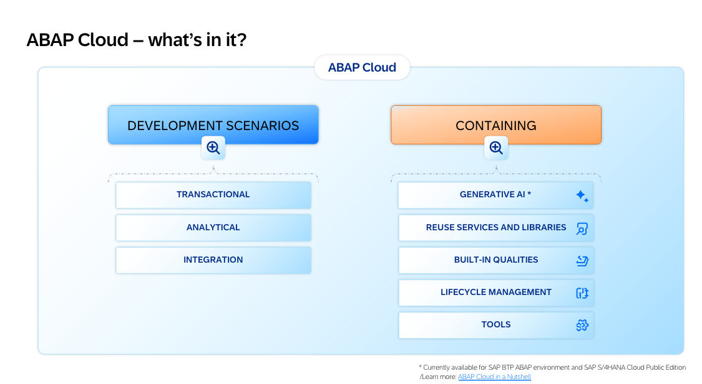
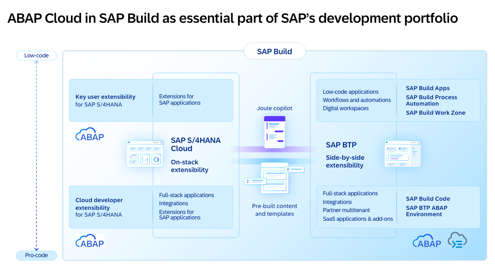
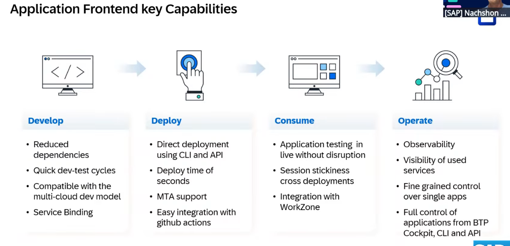
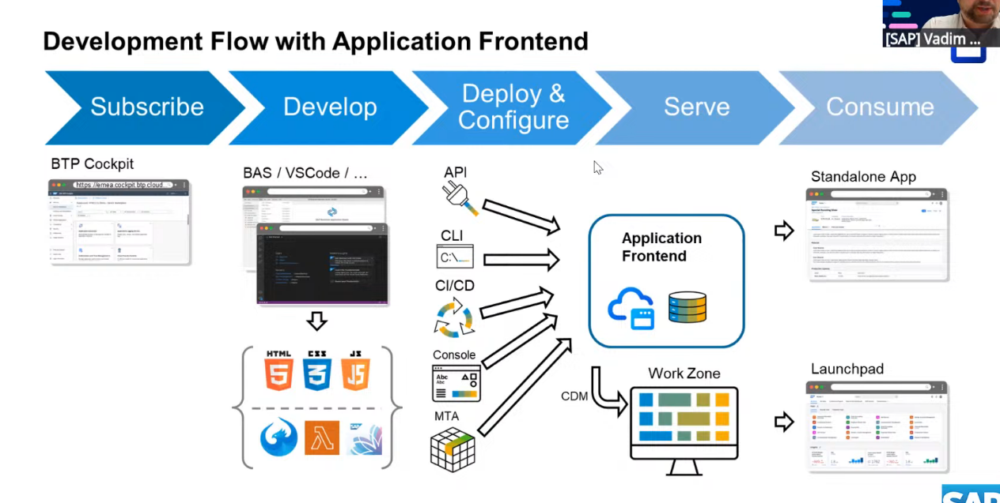
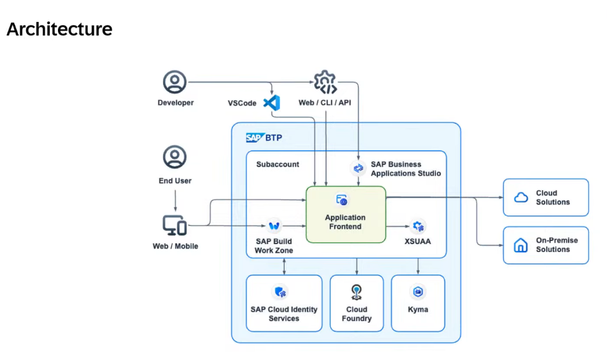
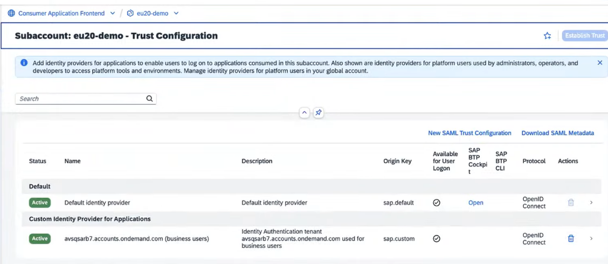
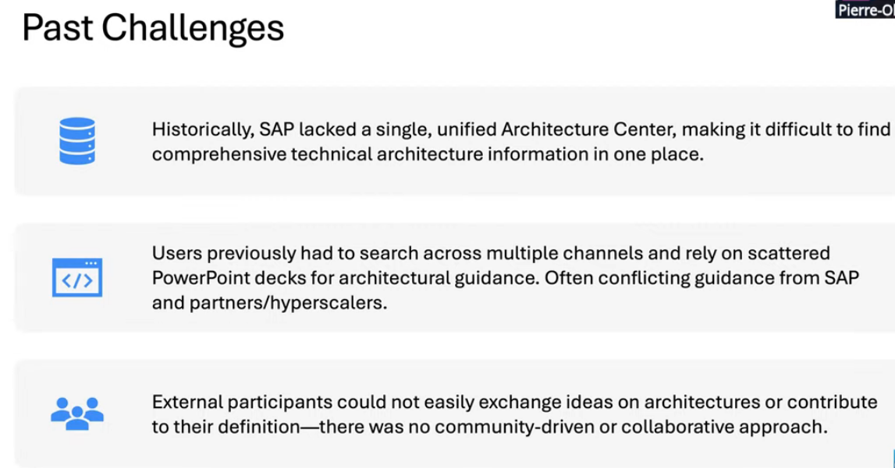

##ABAP cloud

Clean Core Extensibility Strategy powered by ABAP Cloud and Generative AI

<iframe width="560" height="315" src="https://www.youtube.com/embed/Zmo7YU9BUlc" title="ABAP Cloud and Generative AI" frameborder="0" allow="accelerometer; autoplay; clipboard-write; encrypted-media; gyroscope; picture-in-picture" allowfullscreen></iframe>

Presentation on ABAP cloud https://dam.sap.com/mac/app/p/pdf/asset/preview/gisw4N2?ltr=a&rc=10&doi=SAP1241668

##UI

Introducing Application Frontend: Simplifying UI App Hosting

###setup process

https://www.youtube.com/watch?v=cqRC6_50tlE&list=WL&index=5

##Joule agents

https://www.youtube.com/watch?v=o5zIoawwKso&list=WL&index=3

Deck 

##Diagrams

Draw.io https://www.youtube.com/watch?v=mXdqs39qYtI

