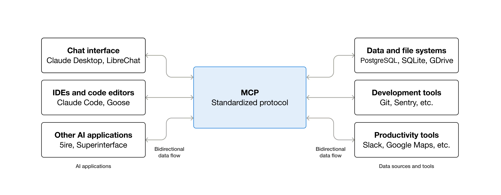

## MCP — Model Context Protocol (overview)

This page collects resources and visual material for the Model Context Protocol (MCP). It includes reference links, diagrams and video resources to help you get started building multi-agent systems and integrating MCP with SAP technologies.

## Key resources

- Official MCP docs: [Getting started — Model Context Protocol](https://modelcontextprotocol.io/docs/getting-started/intro)
- Visual guide / diagram: [Visual Guide to Model Context Protocol — DailyDoseOfDS](https://blog.dailydoseofds.com/p/visual-guide-to-model-context-protocol)

## Diagrams

Local diagram (embedded)

External (hosted) diagram

[MCP simple diagram (external)](https://mintcdn.com/mcp/bEUxYpZqie0DsluH/images/mcp-simple-diagram.png?fit=max&auto=format&n=bEUxYpZqie0DsluH&q=85&s=35268aa0ad50b8c385913810e7604550)

## Video resources

### Demystifying the MCP, A2A, and ACP Protocols

- Watch on YouTube: [Demystifying the MCP, A2A, and ACP Protocols (YouTube)](https://www.youtube.com/watch?v=ki-4CHTT8O8&list=WL&index=1&t=11s)

Click the thumbnail to open the video on YouTube. If your site supports inline HTML, an iframe fallback is provided in an HTML comment below.

<!--

	<iframe width="640" height="360" src="https://www.youtube.com/embed/ki-4CHTT8O8" title="Demystifying the MCP, A2A, and ACP Protocols" frameborder="0" allow="accelerometer; autoplay; clipboard-write; encrypted-media; gyroscope; picture-in-picture" allowfullscreen></iframe>

-->

### Create MCP on SAP BTP (Northwind example)

- Watch on YouTube: [Create MCP for Northwind on BTP (YouTube)](https://www.youtube.com/watch?v=04wwKJrK08A)

<!--

	<iframe width="640" height="360" src="https://www.youtube.com/embed/04wwKJrK08A" title="Create MCP for Northwind on BTP" frameborder="0" allow="accelerometer; autoplay; clipboard-write; encrypted-media; gyroscope; picture-in-picture" allowfullscreen></iframe>

-->

### MCP in SAP context — sitMUC 2025 talk

- Watch on YouTube: [Open Source Joule for Consultants — Marian Zeis (YouTube)](https://www.youtube.com/watch?v=vTZCeaxsOwU)

## API / Other resources

- Overview video and examples of MCP server with SAP: [MCP overview video](https://www.youtube.com/watch?v=Ql2FQaF0IRo&list=WL&index=5)

---

_(Images and thumbnails use YouTube/image-hosted thumbnails. If you prefer inline embedding, enable iframe HTML in the site build or use a Jekyll/VitePress include.)_

